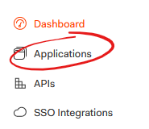
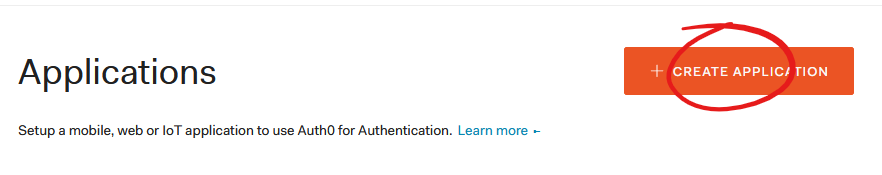
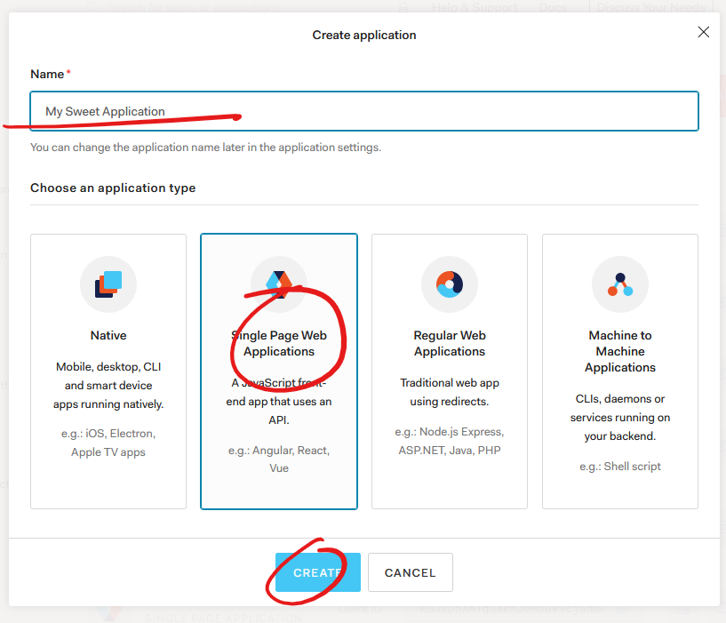
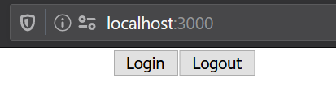
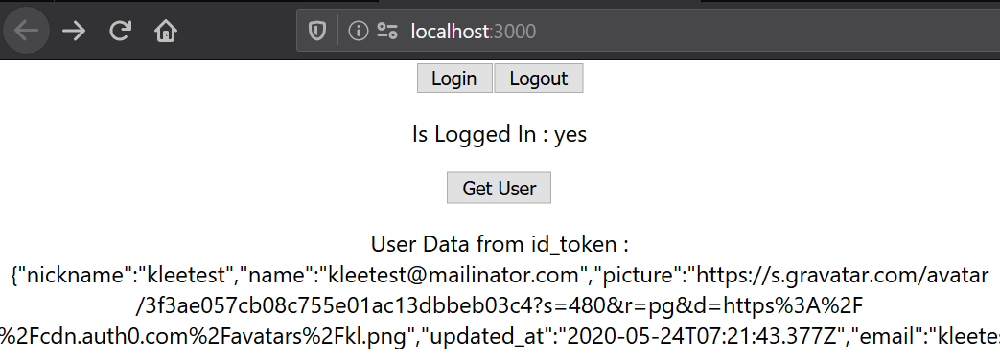
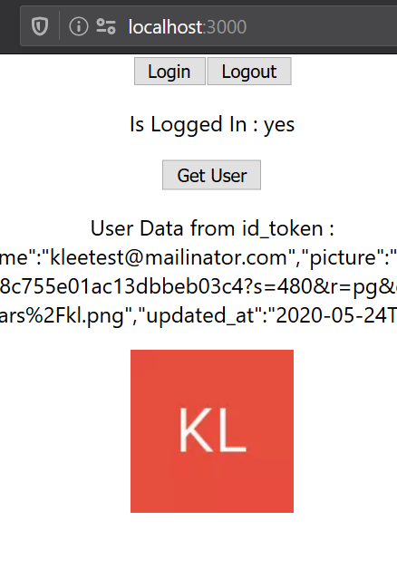

What is the minimum you need to to do get a React SPA set up so that it can log in using Auth0.
There are two parts to this, configuring Auth0 and creating the React application.

# The Configuring Auth0 part

The first thing is to get Auth0 set up. For this you'll need an _Appication_ in Auth0.

Log ito the Auth0 Dashboard.

If you haven't signed up to Auth0 now is the time

## Create an application

The Auth0 application encapsulates the information and settings for each piece of software that will use Auth0 as it's identity store. All applications for a single tenant share the same set of users and authentication experience.

> _Side note: I always find it confusing that Auth0 is an *application* that has *applications* that represent code that you'd normally call *applications*._

Select the Appications link in the navigation



Select Create Application


1. Set the name of the application. What ever you want to call it. This can be chnaged later.
2. Select Single Page Application. This gives you a set of defaults for the type of appliction you're creating. These can be modified later.
3. Click Create.

This will set up the appliation with default configuration for a Single Page Application. All this coniguration can be changed later if you need/want to.



In the settings add `http://localhost:3000` to the `Allowed Callback URLs`, `Allowed Logout URLs`, `Allowed Web Origins` and `Allowed Origins (CORS)` fields. This is because the sample client will be running on `http://localhost:3000` you'll need to add the appropriate values if you're running on a server or a different port or on a host that isn't `localhost`.

The rest of the defaults can be left as is.

Take note of the Domain and Client ID properties. These will need to be copied into the JavaScript code later.

# The JavaScript part

## Set up the scafold

I'm going to use [Create React App and Typescript](https://create-react-app.dev/docs/adding-typescript/) to build a small client that runs on localhost which can be authed into. To get the scafold set up run:

- `npx create-react-app my-app --template typescript`
- `cd my-app`
- `npm install --save typescript @types/node @types/react @types/react-dom @types/jest`

## Add the Auth0 SPA SDK

Run:
`npm install --save @auth0/auth0-spa-js`

## Wire it together

Open the output of the create the react app in your code editor of choice.

Open the `App.tsx` file and remove the `<header>` element and it's children along with the logo import to keep the file as small as possible. It should look like this:

```TSX
import React from 'react';
import './App.css';

function App() {
  return (
    <div className="App">
    </div>
  );
}

export default App;
```

Import the `Auth0Client` class and the `Auth0ClientOptions` type definition from the Auth0 sdk

```TypeScript
import {
  Auth0Client,
  Auth0ClientOptions,
} from "@auth0/auth0-spa-js";
```

Go back to Auth0 and grab the Domain and Client ID properties and add them as configuration passed to the `Auth0Client` constructor.
This is the Auth0 client that abstracts away the complexities of the OAuth2 and Open Id Connect (OIDC) protocols.

```Typescript
const configureAuth0Client = (): Auth0Client => {
  const auth0Config: Auth0ClientOptions = {
    domain: "klees-test.au.auth0.com",
    client_id: "kGJxD5Xh1gSXknJeH6uV9cjadmkZKP0B",
  };
  return new Auth0Client(auth0Config);
};
```

### Create the custom hook

To make use of Auth in our component lets use a custom hook. Add a new function to the file called `useAuth`. This hook will provide an object with login related properties and functions to the component its called from. For now lets set the return type to `{login:() => Promise<void>; logout:()=> void: isLoggedIn: boolean;}`. This means that the output of the hook will give us a way to get the user to log in, log out and a way for our app to know that they're authenticated.

Start by creating a parameterless function called `useAuth`

```TypeScript
function useAuth():{login:() => Promise<void>; logout:()=> Promise<void>: isLoggedIn: boolean;} {}
```

#### State

To power this function we are going to need two peices of state. Update the React import to bring in `useState` `import React, { useState } from "react";`

We are going to need to know that the user is logged in and we are going to need an instance of `Auth0Client`.

```TypeScript
const [isLoggedIn, setLoggedIn] = useState(false);
const [auth0Client, setAuth0Client] = useState<Auth0Client>();
```

To avoid creating the `Auth0Client` over and over lets check if it exists and if it doesnt create it and store it in the state.

```TypeScript
if (!auth0Client) {
  setAuth0Client(configureAuth0Client());
}
```

#### Log in and Log out functions

We need to set up the login and log out functions. Add these within the `useAuth` function.

The login function needs to be `async` since the `loginWithPopup` Auth0 SDK call is going to be making a few https calls while hiding the OIDC process from us.
The `loginWithPopup` function opens a new window which the user can log into. When the login in complete the promise will complete and our user is logged in.

```TypeScript
async function login(): Promise<void> {
  try {
    // Have Auth0 popup a login window and Wait for Auth0 to do the OIDC work for us.
    await auth0Client?.loginWithPopup();
    // Update the state to represent that the user has logged in.
    setLoggedIn(true);
  } catch (e) {
    // If something goes wrong lets put it out to the console.
    console.error(e);
  }
}
```

```TypeScript
function logout(): void {
  try {
    // Call the client to log the user out.
    auth0Client?.logout();
    // Update the state to represent the user is logged out.
    setLoggedIn(false);
    setUserData("All Logged out");
    setGravatar("");
  } catch (e) {
    // If something goes wrong put it out to the console.
    console.error(e);
  }
}
```

With these two function in place we have everything we need to complete our hook. Finish it by returning the `isLoggedIn` state along with the `login` and `logout` functions.

```Typescript
return {
  login,
  logout,
  isLoggedIn
}
```

### Set up the display

Back in the app function. Call the custom hook and hang onto the result.

```Typescript
const auth = useAuth0();
```

Inside the `<div className="App">` add 2 buttons one for logging in and one for logging out. In the `onClick` handler for each of these call `auth.login` and `auth.logout` respectivly.

```TSX
<button onClick={auth.login}>Login</button>
<button onClick={auth.logout}>Logout</button>
```

If you stop and test the app at this point a user will be able to log in and log out, but... there is no way to see what state the app isin.
Let's render if the user is logged in or not to the screen. Add a `<p>` tag below the buttons and use the `auth.isLoggedIn` state variable to render if yes if they are or no if they're not.

```Typescript
<p>Is Logged In : {auth.isLoggedIn ? "yes" : "no"}</p>
```

This is great but it would be nice to know at least a little bit about our user.



### Getting User Data

#### Update the hook

The Auth0 SDK allows us to get some information from the `id_token` that is returned as part of the OIDC flow.

Lets go back to the `useAuth` hook and add two extra properties to the return value. A `getUserData` and `userData` as a function the returns a promise of void and a string respectively.

```Typescript
{
  login: () => Promise<void>;
  logout: () => void;
  isLoggedIn: boolean;
  getUser: () => Promise<void>;
  userData: string;
}
```

First lets add a new state item to hold the user data. Lets make this a string with a default value so we can see it before the user has logged in.

```Typescript
const [userData, setUserData] = useState("Nothing Yet");
```

Next we'll add a function to get the user from Auth0 and store it in the `userData` state.
The data that comes from the `auth0Client?.getUser()` call is an object with no defined structure. There are some basic properties that are on the object that we can look at. So that we can have a look at the structure lets convert the object into a JSON string before storing it in `userData`.

```Typescript
async function getUser(): Promise<void> {
  try {
    // Gets the data about the user from the id_token
    const data = await auth0Client?.getUser();
    // Make the user data into a string so we can dump it to the screen.
    setUserData(JSON.stringify(data));

    setGravatar(data.picture);
  } catch (e) {
    // If something goes wrong put it out to the console.
    console.error(e);
  }
}
```

Add the `getUser` function and the `userData` state to the returned value.

```Typescript
return {
  login,
  logout,
  isLoggedIn,
  getUser,
  userData,
};
```

#### Update the display

In the display code add two new elements below the is logged in display.

Add a button to call the `auth.getuser` function and a `<p>` element to display it.

```tsx
<button onClick={auth.getUser}>Get User</button>
<p>User Data from id_token: {auth.userData}</p>
```



### Show the user avatar

Looking at the json blob we just dumped to the screen there is a property called `picture` this has a link to Gravatar that Auth0 has kindly put in there for us. For final bonus points lets display that on the page as well.

To do that we can add another state property and include it as a property to the output of our hook.
Add the state property to the top of the hook code.

```Typescript
const [gravatar, setGravatar] = useState("");
```

In the `getUser` function let's store the picture in the `gravatar` state property by calling `setGravatar`.

```Typescript
// Gets the data about the user from the id_token
const data = await auth0Client?.getUser();
// Make the user data into a string so we can dump it to the screen.
setUserData(JSON.stringify(data));
// Set the source for the user avatar
setGravatar(data.picture);
```

Add gravatar to the object returned from the hook.

```Typescript
return {
  login,
  logout,
  isLoggedIn,
  getUser,
  userData,
  gravatar,
};
```

And add the image onto the page.

```TSX
      
```

The final output should look a bit like this:

