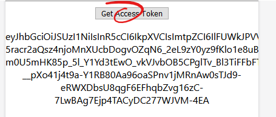

This follows on from my previous post setting up auth in a React SPA.

In that example the application is getting user data from Auth0 but it doesn't have an access token to allow us to authenticate an API.

This will go through setting up an API in Auth0 so that the client can get a JWT (JSON Web Token) access token that can be used to prove authentication do a separate API.

# Getting a token

Working from the base of the previous article the `useAuth` function can be extended to provide the authentication token that the `Auth0Client` class is receiving after login.

To do this, a function to request the token from the client. This is an asynchronous call so we can reuse the pattern of requesting a token from the `Auth0Client` instance and storing it in a state value with the `useState` hook so it can be rendered once it's available.

Add a state value to store the access token, a function to get and store the token. Add both the new function and state value to the `useAuth` functions signature and return value.

```TypeScript
  function useAuth0(): {
...
    gravatar: string;
    getAccessToken: () => Promise<void>;
    accessToken: string;
  }

...

  const [accessToken, setAccessToken] = useState("");

...

  async function getAccessToken(): Promise<void> {
    try {
      const token = await auth0Client?.getTokenSilently();
      setAccessToken(token);
    } catch (e) {
      console.log(e);
    }
  }

...

  return {
...
    accessToken,
    getAccessToken,
  };
```

Render these new values in the view by adding this at the bottom of the `<div className="app">` element.

```TSX
<button onClick={auth.getAccessToken}>Get Access Token</button>
<p>{auth.accessToken}</p>
```

When the token is rendered to the screen the output isn't the JWT that can be used to authenticate to an external API. Instead it's an opaque token that looks something like this:


This is because with no API is specified as an `audience` parameter when configuring the Auth0 client, Auth0 returns an opaque token that is only usable to get access to the identity information stored within Auth0.

To get an access token that can be used to authenticate to an API Auth0 needs to know about that API. To do that we need to configure the API in the Auth0 tenant.

# Modeling an API to Auth0

Where the application in Auth0 represents the user entry point to the system, the API represents the resource that is being secured/accessed.
An API is required to be specified in order to get an access token. Each access token is valid for one API.

Select APIs in the navigation menu


Create a new API


In the Create API dialogue enter a name for the API as well as an identifier.
Auth0 suggest using a URL as the identifier, but you can use any identifier that you want. You need to be aware though that:

- The identifier needs to be unique across APIs in your tenant.
- The identifier _can not_ be changed.
- You will be including it code that will be executed in the browser.


Once you've clicked Create API note down the identifier that you used. The default settings for this API are fine for the purposes of this blog.

# Using the API to get a JWT access token

With the API set up the next step is to configure the SPA to make use of it. Copy the identifier that you used for the API.


Back in the SPA code add this to the parameters passed to the `Auth0Client` constructor.

```TypeScript
const configureAuth0Client = (): Auth0Client => {
  console.log("Making new client");
  const auth0Config: Auth0ClientOptions = {
    domain: "klee-test.au.auth0.com",
    client_id: "wwk4gzlOJENxSd97zZtbsxJp5qQq4oI3",
    audience: "TheSweetestAPI",
  };
  return new Auth0Client(auth0Config);
};
```

Run the code and log in again.
Auth0 will pop up a page asking for the user to authorise the application acting on it's behalf. Don't worry this can be turned off so your production users don't have to see it when accessing your own APIs. Click the green tick to progress back to the SPA.


Now when the Get Access Token button is clicked the token that is rendered to the screen with be a full JWT.



To interrogate the JWT copy it and paste it into the `Encoded` field in [jwt.io](jwt.io). This will show the token decoded. Everything in the token is there for a reason but 2 fields that are worth noting for this example are the `aud` and `azp` fields.
The `azp` field is the Auth0 Application identifier and `aud` field includes the audience identifier that was passed into the `Auth0Client` constructor along with the endpoint for accessing user information stored in Auth0.

```JSON
...
  "aud": [
      "TheSweetestAPI",
      "https://klee-test.au.auth0.com/userinfo"
  ],
...
  "azp": "wwk4gzlOJENxSd97zZtbsxJp5qQq4oI3",
...
```
